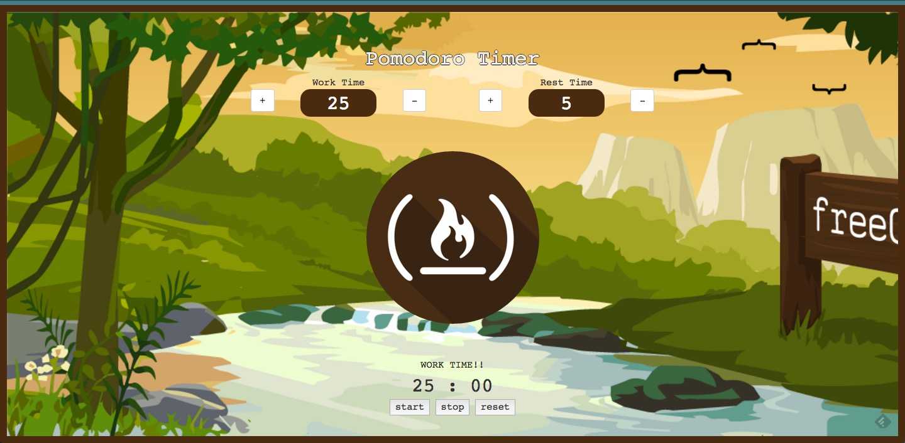
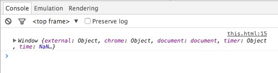

#The pomodoro clock project (Under construction!)



This post is my solution for the Basic Front End Development Project from FreeCodeCamp [Build a Pomodoro Clock](http://www.freecodecamp.com/challenges/zipline-build-a-pomodoro-clock). This is a walk through of the steps I made and decitions I took during its development. The aim of this post is helping other fellow campers, give ideas and, overall, serve as a log to myself.

##Making our clock ticking
Isn't strange that the first thing I thought about when I was aproaching this exercise was how to decrease continuosly a variable each second. For that purpose I made a research and I found out these 2 functions:

```javascript
setTimeout(function, miliseconds);
```
and

```javascript
setInterval(function, miliseconds);
```

[setTimeout()](http://www.w3schools.com/jsref/met_win_settimeout.asp) *executes once* the function passed as first parameter after the time setted in milisecond as the second parameter.
On the other hand, [setInterval()](http://www.w3schools.com/jsref/met_win_setinterval.asp) executes the function every x miliseconds, just what I needed.

```javascript
var time = 30;

setInterval(function(){
 if(time >= 0){
  time--;
 }
},1000);
```
With this code, as soon as the page loaded the timer started a countdown. However I needed to be able to choose when the timer should start and when it should stop.

The way of stopping an interval is by calling the function `clearInterval()` which takes as a parameter the function name where the `setInterval()`is defined.

```javascript
var time = 30;

//The interval starts
var timer = setInterval(function(){
 if(time >= 0){
  time--;
 }
},1000);

//The interval stops
clearInterval(timer);
```
###The *this* problem

Once I had the timer ticking, the point was to be able to start it and stop it with the user interaction. I could just have had some functions and a global variable for the time. However, due to my Java experience for my last year of vocational training, I have this mindset of having everything encapsulated inside objects. Thus, I came with this structure for the timer:

```javascript
var timer = {
  time: null,         //the time set by the user
  timeHandler: null,  // variable which hosts the setTimer func

  startTimer: function(){},

  stopTimer: function() {}
  };

  //Controls using jQuery
  $('#start').click(function(){timer.startTimer();})
  $('#stop').click(function(){timer.stopTimer();})
}
```
 At this point I had my first big trouble and was related with the scope and the *this* keyword. This was my first attempt to implement the startTimer method

 ```javascript
var timer = {
  //...

  startTimer: function(){
    this.timeHandler = setInterval(function(){
      this.time--;
    }, 1000);
  },

  stopTimer : function() {
    clearIterval(this.timeHandler);
  }
}

timer.startTimer();
 ```
This piece of code wasn't work because I was missing how *this* works. Accordingly with my implementation, I was supposing that *this* was bound to the object in which it was defined. In other words, I thought that as I was using *this* inside a function bounded to a method (`startTimer`) of an object (`timer`), *this* should refer to that object. However, this is one of the tipical missconceptions as pointed out in the Udacity course [Object-Oriented JavaScript](https://www.udacity.com/course/object-oriented-javascript--ud015) at [this video](https://youtu.be/ehZKcas9R-4?t=1m48s). So, if it wasn't bound to `timer`, what was `this` bound to?
*this* is bounded always to the object that calls the method where it appears. This is really weird to explain in words, thus I'll add some examples

```javascript
var object_instance = {
  method: function(){
    console.log(this);
  }

object_instance.method();
}
```
In this case, this did what someone like me, with a bit of Java background, would expect. *this* is bound to `object_instance`. However:

```javascript
var foo = function(){
  console.log(this);
}

foo();
```


In this other scenario, this is inside a function which is used in direct call (There's no *dot* call, so to speak). In this case *this* is bound to the `window` object. But what's this `window`object? My first thought was that it was like the `object` class in Java, the parent of all the other objects. I was wrong though.

>The window object is supported by all browsers. It represents the browser's window.
>All global JavaScript objects, functions, and variables automatically become members of the window object.
>
>Global variables are properties of the window object.
>
>Global functions are methods of the window object.
>
>Even the document object (of the HTML DOM) is a property of the window object
>
>Source: [w3schools](http://www.w3schools.com/js/js_window.asp)

Accordingly to the quote what I was doing with the *free call* actually was something like `window.foo()` and that's the reason why `this` is bound to `window`.

Once that was clear, I was able to go back to my `startTimer()` function and understand that what I was doing was the same as a free call and I had to use the variable *that*


```javascript
var timer = {
  //...

  startTimer: function(){
    var that = this;
    this.timeHandler = setInterval(function(){ //this is equivalen of doing a
                                                //free call
      that.time--;
    }, 1000);
  },

  stopTimer : function() {
    clearIterval(this.timeHandler);
  }

  timer.startTimer();
}
```

This is a trick I learnt in the [Object-Oriented JavaScript course](https://www.udacity.com/course/object-oriented-javascript--ud015). When I call `timer.startTimer()` I'm doing the *dot call* so the parameter `this` is passed to `starTimer` bounded to `timer`. However, `setInterval` is a free call, so `this` isn't bound to `timer` but `window`. For this reason I set `that`to be the value of `this`in the `startTimer` function, so I was able to refer to `timer` inside `setInterval`. 

##Refering to an attribute while creating the object.

I tried to set the timer default parameters like this:

```javascript
  var timer = {
   totalSeconds : 25,
   runningTime : this.totalSeconds 
  }
```

However this is not allowed in javascript since the instance of the object is not created until it loads all the code inside the object. So for the time the interpreter tried to execute `this.totalSeconds` there's no `this` to refer to yet.

The way I solved it was by creating a `setTimer` method

```javascript
  var timer = {
    totalSeconds : null,
    runningTime : null,

    setTimer: function(secs) {
      totalSeconds = secs;
      runningTime = secs;
    }
  }
```
 I'm aware though, that this may not be the optimal way to do it. Surely It would be much beter create a contructor function for `timer`. However, I decided to do it in this way for simplicity since I was only going to have an instance of `timer`.

##SVG animation
I wasn't sure why, but one day I feel like having a circle which was eventually filled with red but emulating the movement of a clock. I know that may explanation might not be very clear (sorry about that), so the best way to show it is by showing the codepen.io project that inspired me.

[](http://codepen.io/agrimsrud/pen/EmCoa) 

I used almost all the original but some little changes I made for making the animation synchronized to the pomodoro and it's color.

```javascript

function animationHandler(seconds, color){
  var loader = document.getElementById("loader");
  var alpha = 0;
  var pi = Math.PI;
  var t = 30;
  var totalTimePeriod = seconds;
  $('#loader').css("fill", color);
  
  function draw(secs) {
    alpha = 360 * (secs/totalTimePeriod); //angle for a given second
    var r = ( alpha * pi / 180 );
    var x = Math.sin( r ) * 125;
    var y = Math.cos( r ) * - 125;
    var mid = ( alpha > 180 ) ? 1 : 0;
    var anim = 'M 0 0 v -125 A 125 125 1 ' +
            mid + ' 1 ' +
             x  + ' ' +
             y  + ' z';
   
    loader.setAttribute( 'd', anim );
  }

  return draw;
}
```

I used the scope property of JavaScript for setting first some variables that will remain only available for the function returned. 

Basically, I set the seconds that the pomodoro will last and the color of the fill first. Then, with the function returned, I can draw the animation for any second passed as argument.

I would like to beeing able to explain this code a bit more, but I don't really get how svg path works. As far as I know, with this code you are defining the parameters of the shape the svg will take, and with all this we are defining a circle sector which grows gradually in each run. It's quite hard coding indeed, because you literally are specifying a "path" the computer has to do for drawing your shape. If you want to read more you can go [here](http://www.w3schools.com/svg/svg_path.asp).

I tried to do the filler went counter clockwise by changing some parameter but I wasn't succesfull. I will have to return to this in the future.

##The FreeCodeCamp clock face
For simplicity, instead of having a div as a circle and align it with the filler, I used the same `svg` tag I used for the filler and add another svg element, the `<circle>` tag. Here is the code:

```html
<svg width="250" height="250" >
        <!-- Create a pattern for allowing having an image as a background -->
        <defs>
          <pattern id="image" patternUnits="userSpaceOnUse" height="250" width="250">
            <image x="0" y="0" height="250" width="250" xlink:href="https://pbs.twimg.com/profile_images/562385977390272512/AK29YaTf.png"></image>
          </pattern>
        </defs>
      <!-- The clock face -->
      <circle id='top' cx="125" cy="125" r="125" fill="url(#image)"/>
      <!-- The clock filler: to cover the clock face gradually -->
      <path id="loader" transform="translate(125, 125)"/>
</svg>
```
As you can see, the way of doing it is by creating a pattern which I'll call by it's id in the `fill` parameter of the `circle` tag.

##Demo

Of course all the little code snippets I posted here aren't the full code, but these parts I've commented were the things I had to learn for doing this pomodoro. However if you want you can see a demo of the pomodoro in [codepen](http://codepen.io/edgarshurtado/full/XmePZx/) or you can see my original code and contribute at [my repository](https://github.com/edgarshurtado/CodeLearningMaterial/tree/master/MOOCs/FreeCodeCamp/Ziplines/PomodoroClock). I'm open to suggestions.

Thanks for reading =).